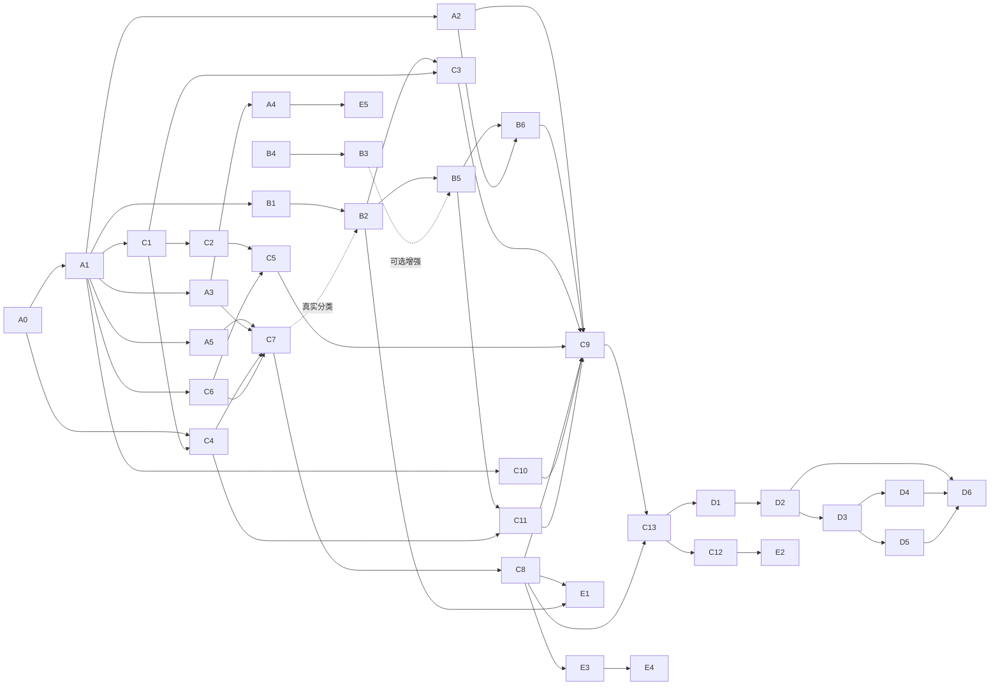

# Agent 实施手册与任务拆分

> 配套：[agent-design.md](./agent-design.md)（设计理由）・[agent-patterns-digest.md](./agent-patterns-digest.md)（资料速查）・[agent-beta.md](./agent-beta.md)（现状）
>
> 本文是 **Agent 改造的执行侧唯一真相（implementation source of truth）**：代码放置、模块依赖、数据契约、任务前置、验收与回滚均以本文为准。设计文档解释“为什么”；若示例与本文契约冲突，以本文为准，并回补设计文档。

---

## 0. 开发者怎么用

> **实施状态（2026-09-17）**：正式完成并经 Codex 独立核对、主目录集成的基线为 A0＋P0、B1/B2/B5/B6、C1～C13、**E1**，共 **24/39 张任务卡**。E1 的 shadow-only 实现由 Kiro 完成（自测 895/895），Codex 用 23/39 基线哈希还原精确 diff 做独立核对，发现 7 个问题（含一个可实证的 C8 发布门削弱：账本仍 ADMITTED 而本轮 decision 未准入时带 views 会上画布），在 E1 白名单内返工并补 10 条回归后最终 **905/905**，非增量 TypeScript、17 文件 ESLint、架构守卫、`git diff --check` 全绿并已集成。详情见 [E1 验收与独立核对](./agent-e1-acceptance.md)，最新续接与下一步见 [会话交接](./agent-session-handoff.md)，过程见 [开发恢复记录](./agent-resume-progress.md)。v1 flag 仍默认关闭，未调用真实产品模型/图片供应商，未操作测试站、build 或发布。hard mode 仍未获批。B3/B4 和 P3～P5 按下方闸门与依赖另行推进。

> **后续复核补记（2026-09-17）**：E1 返工 R3～R7 的独立复核已由 Codex 主会话补齐，无需产品代码返工；905/905 与其余四项检查重跑通过。24/39 不变，见 [兜底复核](./agent-e1-takeover-review.md)。

### 0.1 执行顺序

1. 先完成 **A0 契约冻结**，评审勾选 §2.10 的开工清单。
2. 每次只领取依赖已完成、决策闸门已满足的任务卡。
3. 开工前写出该卡的输入、输出和失败语义；不得在实现中临时发明第二套状态。
4. 完成后跑任务卡中的本地定向测试、`pnpm typecheck`、受影响文件 lint；本阶段测试站按用户节奏另行安排，不把本地验收写成测试站通过。
5. 测试站未通过前不构建、不发布生产；生产发布严格遵守 `AGENTS.md`。

规模：`S` 半天内 · `M` 1～2 天 · `L` 3～5 天（含测试与测试站验收）。任务 ID 稳定，不重编号；新增任务向后追加。

### 0.2 默认开工基线

在 Q1～Q3 尚未最终拍板时，v1 使用以下兼容基线，不阻塞基础开发：

- 产品行为按 **Q1-A：自然语言表单外壳**，但 `GoalContract`、`stepId` 类型保留 B 的形状。
- 一次批准只覆盖 **一个付费任务**；在 Q2 拍板前，执行策略强制 `resultCount=1`。契约保留已批准张数字段，但任何 `resultCount>1` 或多任务自动串联只允许生成预览，不得真实提交。
- 感知先做确定性能力 B1/B2；B3/B4 等 Q3。
- 四个既有表单入口完全不变；新逻辑只从 Agent Beta 入口启用。

### 0.3 一张任务卡的 Definition of Done

除卡片另有说明外，每张卡都必须满足：

- 新增/修改的公开类型有注释，说明谁写、谁读、是否可由模型影响。
- 所有控制平面字段均可追溯来源；客户端和模型不能伪造服务端真值。
- 失败语义明确，不把 `unknown` 当 `failed`，不在未知副作用后自动回退重试。
- 定向测试、`pnpm typecheck`、受影响文件 lint 通过。
- 没有改变四个既有表单功能的可观察行为。
- 高风险迁移有旧数据夹具、备份、读旧写新兼容和回滚说明。

---

## 1. 模块地图

### 1.1 目录结构

```text
lib/agent/                              # 同构类型与纯函数，禁止 I/O
  types.ts                              # Observation / Route / Plan / Tool
  contracts.ts                          # Preview / Approval / Ledger schema + digest
  budget.ts                             # Agent 预算单一真相
  provenance.ts                         # 字段来源与准入矩阵

lib/server/agent/
  ports.ts                              # Query/Command/Planner/Event 等端口；只定义接口
  runtime.ts                            # composition root；唯一组装真实依赖的位置
  turn.ts                               # 主循环；不直接持有 task-store / provider capability
  perception/
    observation.ts
    observation-store.ts
    context-triage.ts
  reasoning/
    router.ts
    planner.ts
    validators.ts
  action/
    tool-registry.ts
    tool-frontier.ts
    tool-dispatch.ts
    read-tool-runner.ts                 # 只执行纯读取/本地无副作用工具
    tools/*.ts                          # create_* 仅构建 dry-run PreviewArtifact
  governance/
    gateway.ts                          # PRE → TOOL → post-submit
    task-adapter.ts                     # 唯一持有 TaskCommandPort 实现
    result-admission.ts                 # 异步结果准入，不在提交响应内假装完成
    hooks/pre-*.ts
    hooks/post-submit-*.ts
    hooks/result-*.ts
    action-ledger.ts
    unknown-reconciler.ts
  memory/                               # v2
  reflection/                           # v2
  observability/
    events.ts                           # 服务端权威事件
    event-store.ts                      # append-only Agent 事件
    replay.ts

lib/server/agent-beta/                  # HTTP/会话适配层
  access.ts http.ts llm-config.ts validation.ts
  repository.ts                         # 会话 + preview/trace 引用
  service.ts                            # CRUD + 转调 turn/gateway，不新增编排
  runtime.ts                            # 转调 lib/server/agent/runtime.ts

components/agent-beta/
  plan-preview-card.tsx
  tool-trace.tsx
  visual-feedback.tsx                   # v2
```

### 1.2 职责与禁止事项

| 模块 | 职责 | 禁止 | 对外入口 |
| --- | --- | --- | --- |
| `lib/agent` | 类型、常量、canonical digest、来源矩阵 | I/O；import `lib/server` | 纯导出 |
| `perception` | 原始素材 → Observation/Snapshot | 创建任务；改任务状态；执行付费生成 | `buildSnapshot()` |
| `reasoning` | 路由、计划、确定性验证 | import task-store；直接执行工具 | `route()` / `plan()` |
| `action` | 注册、前沿、选择、dry-run | 持有 `TaskCommandPort`；调用 provider；真实创建任务 | `dispatch()` |
| `governance` | 唯一外部副作用入口、审批、账本、结果准入 | 生成业务创意；信任客户端回传参数 | `gateway.execute()` / `admitResults()` |
| `memory` | 目标、进度、失败经验 | 工具直接写；覆盖 append-only 账本 | 仓储端口 |
| `reflection` | 评审问题与确定性裁决 | Critic 直接放行；自动付费重生 | `critique()` / `decide()` |
| `observability` | 权威事件、上下文工件、回放 | 反向 import 任一业务子模块 | `recordAgentEvent()` |
| `agent-beta` | HTTP、门禁、会话 CRUD、协议适配 | 新增业务编排；直接 import task-store | Next.js route |

### 1.3 依赖方向

```text
Next route
  → agent-beta service/repository adapter
    → AgentTurnPort / ControlledTaskGatewayPort
      → turn
        → perception / reasoning / action
        → governance port（仅非纯工具）
      → governance implementation
        → task-adapter
          → task-store / cutout-session-service / provider adapters

runtime.ts (composition root)
  → 可 import 所有具体实现，但 TaskCommandPort 只能注入 governance

任意层 → observability port
observability implementation → 不反向依赖业务层
```

`runtime.ts` 是唯一 composition-root 例外；“能 import task-store”不等于“能把 createTask capability 交给任意模块”。A5 同时检查 import 与依赖注入接线。

### 1.4 外部动作统一规则

不能只按“是否扣 credits”判断风险。工具元数据必须同时声明：

```ts
type CostClass = 'free' | 'vendor_api' | 'paid_generation'
type SideEffectClass = 'none' | 'local_write' | 'external_reversible' | 'external_irreversible'
type ApprovalPolicy = 'none' | 'explicit_user_intent' | 'preview_confirmation' | 'always'
```

- 只有 `costClass='free' && sideEffectClass='none' && readOnly=true` 可由 `read-tool-runner` 自动执行。
- `garment.classify` 虽是读取语义，但属于 `vendor_api`，必须经 Gateway、额度和每轮配额。
- `cutout.prepare` 有供应商调用和本地写入，必须经 Gateway；是否弹二次确认由 `approvalPolicy` 决定。
- 所有 `paid_generation` 必须 `preview_confirmation`，模型侧永远只有 dry-run。
- `task.cancel` 虽免费但有写副作用，也必须经 Gateway。

---

## 2. A0：开工契约冻结

> A0 是新增的前置卡。它不写生产业务实现，目标是消除后续任务会各自猜测的状态、摘要、时序和权限问题。

### 2.1 冻结的核心工件

```ts
interface PreviewArtifact {
  schemaVersion: 1
  proposalId: string
  version: number
  userId: string
  sessionId: string
  messageId: string
  toolName: string
  featureType: FeatureType               // 由 toolName 的服务端注册表映射
  normalizedParams: TaskParams           // 服务端产生，客户端不可回传覆盖
  inputAssetIds: string[]
  assetDigests: string[]
  paramsDigest: string
  policyVersion: string
  estimatedResultCount: number
  normalizationSeed: string              // 冻结随机规划
  resolvedModelId?: string               // 冻结动态渠道解析
  promptTemplateVersion?: string
  blockers: string[]
  riskNotices: string[]
  createdAt: string
  expiresAt: string
}

interface ApprovalReceipt {
  schemaVersion: 1
  approvalId: string
  userId: string
  proposalId: string
  previewVersion: number
  paramsDigest: string
  assetDigests: string[]
  requestDigest: string                  // 绑定完整冻结动作，不仅绑定提示词
  approvedAt: string
}
```

冻结规则：

- `PreviewArtifact` 只保存在服务端；前端确认只提交 `proposalId + previewVersion + paramsDigest`。
- 默认 `PREVIEW_TTL_MS = 30 * 60_000`，定义在 `lib/agent/budget.ts`。
- 提示词允许用户编辑；一旦编辑，服务端创建新 preview/version，旧 approval 自动失效。
- toolName 可以由模型提议，但 `featureType/model/resultCount/assetIds` 必须由服务端注册表、用户选择或系统策略绑定。

### 2.2 canonical digest

`digest(value)` 必须：

1. 递归按对象 key 排序；数组保留顺序。
2. 拒绝 `undefined`、函数、`NaN`、`Infinity`、循环引用；时间先转 ISO string。
3. UTF-8 JSON 后做 SHA-256，输出小写 hex。
4. 摘要输入必须显式带 `schemaVersion`，不同契约版本不能碰撞。

`assetDigest` v1 使用不可变资产记录：

```text
sha256(canonical({
  schemaVersion: 1,
  assetId, userId, createdAt, width, height, taskId: taskId ?? null
}))
```

不放 `fileUrl`，避免签名 URL 轮换导致误失效。v1 假设 `assetId` 对应内容不可原地替换；执行时仍必须重查资产存在性和归属。将来若支持原地替换，先给 `AssetRecord` 增加 contentHash，再升级 digest 版本。

### 2.3 ActionLedger：三个事实轴，不再混成一个 status

```ts
type SubmissionState =
  | 'NOT_STARTED' | 'STARTING' | 'SUBMITTED' | 'UNKNOWN' | 'VERIFYING'

type GateOutcome =
  | 'NOT_RUN' | 'PASSED_PRE' | 'BLOCKED_PRE'
  | 'BLOCKED_POST_SUBMIT' | 'BLOCKED_RESULT'

type SideEffectState = 'NONE' | 'POSSIBLE' | 'CONFIRMED'
type ResultAdmission = 'NOT_APPLICABLE' | 'PENDING' | 'ADMITTED' | 'QUARANTINED'

interface ActionLedgerEntry {
  schemaVersion: 1
  key: string
  userId: string
  sessionId: string
  messageId: string
  proposalId: string
  previewVersion: number
  toolName: string
  featureType: FeatureType
  requestDigest: string
  approvalDigest: string
  assetDigests: string[]
  taskId: string
  providerRequestIds: string[]            // 当前生成链可能为空，不可据此断言未提交
  submissionState: SubmissionState
  taskStatus?: TaskStatus                 // pending/running/success/partial/failed/cancelled
  gateOutcome: GateOutcome
  sideEffectState: SideEffectState
  resultAdmission: ResultAdmission
  evidenceRefs: string[]
  createdAt: string
  updatedAt: string
}
```

不变量：

- `taskStatus='success'` 才表示业务任务成功；`submissionState='SUBMITTED'` 绝不等于成功。
- 调用真实工具前必须先持久化 `STARTING + POSSIBLE`；写盘失败则 fail closed。
- 外部调用超时/进程中断后进入 `UNKNOWN + POSSIBLE`，绝不自动创建第二个任务。
- `BLOCKED_POST_SUBMIT/BLOCKED_RESULT` 只能隔离结果，不能宣称外部副作用已回滚。

### 2.4 旧 ExecutionRecord 迁移

| 旧记录 | task-store 真值 | 新状态 |
| --- | --- | --- |
| `submitted=true` | 找到任务 | `SUBMITTED`；复制真实 `taskStatus`；`CONFIRMED` |
| `submitted=true` | 找不到任务 | `UNKNOWN`；`POSSIBLE`；进入核实队列 |
| `submitted` 缺失 | 找到任务 | `SUBMITTED`；复制真实 `taskStatus`；`CONFIRMED` |
| `submitted` 缺失 | 找不到任务 | `UNKNOWN`；`POSSIBLE`；进入核实队列 |

**任何旧记录都不得仅凭 `submitted=true` 迁成 `SUCCEEDED`。** 迁移先写 `.bak`，支持读旧写新一个版本；不得改变 `getIdempotentTaskId` 算法。

### 2.5 Preview 必须可重放

现有 normalizer 不是全部确定性：

- `photo-fission` 会使用 `Date.now()/Math.random()` 生成裤装抽卡 seed。
- `garment-detail` 会按当时渠道可用性解析 `resolvedModelId`。

因此 C4/C7 必须引入内部准备边界：

```ts
interface TaskPreparationPort {
  prepare(input: UntrustedTaskProposal, context: PreparationContext): Promise<PreviewArtifact>
  validatePrepared(preview: PreviewArtifact): Promise<void>
}

interface TaskCommandPort {
  createPreparedTask(preview: PreviewArtifact, idempotencyKey: string): Promise<GenerationTask>
  cancelTask(taskId: string, userId: string): Promise<GenerationTask>
}
```

实现时从 `task-store.createTask()` 抽取“已归一化参数创建任务”的内部函数：

- 旧表单继续走 `createTask = normalize + createNormalizedTask`，行为不变。
- Agent 走 `prepare → 持久化 preview → createPreparedTask`。
- `createPreparedTask` 重查归属、资产、功能开关和 preview digest，但不重新抽 seed、不切换 resolvedModelId。
- 已批准模型当前不可用时阻断并要求生成新 preview，不能静默换模型。

### 2.6 Gateway 四阶段

```text
PRE
  schema → 用户/会话 → preview/approval digest → 资产存在与归属
  → 功能开关 → 参数范围 → 额度/并发/队列 → 内容策略 → 幂等账

TOOL
  先写 STARTING/POSSIBLE → createPreparedTask → 写 SUBMITTED/CONFIRMED

POST-SUBMIT（同步）
  task.userId / featureType / paramsDigest 与批准一致
  不检查“实际结果张数”，因为任务此时通常仍 pending

RESULT-ADMISSION（异步）
  sync/reconciler 读取终态任务 → 校验结果 asset.taskId、归属、数量上限
  → ADMITTED 后才能上画布；否则 QUARANTINED，保留任务和证据
```

安全硬规则（schema、所有权、approval digest、幂等、结果归属）从第一天硬拦；只有尚未证明准确率的启发式规则可以影子运行。不得把权限和审批一致性放进“一周后再开启”的影子模式。

### 2.7 UNKNOWN 核实边界

核实证据优先级：

1. 稳定 `taskId` 查到任务；
2. 已保存且与该任务绑定的 provider request ID（如果原链路已有，只作为可选证据）。

不接入计费日志或新增积分对账。任务不存在不等于供应商没有执行；只有找到确定证据才能从 POSSIBLE 升为 CONFIRMED。无法核实时保持 UNKNOWN 并转人工，不自动重试。供应商积分按现有 access 接入链路实际扣除，Agent 不估算、预扣、换算或退款。

### 2.8 事件信任边界

分两套名字和入口：

- 服务端权威事件：`turn.* / observation.* / route.* / plan.* / tool.* / gate.* / task.* / stop.*`，只能由 `recordAgentEvent()` 写入 `data/agent-beta/events.jsonl`。
- 客户端交互埋点：继续走 `/api/events`，事件名使用 `agent_ui.*`；不得接受 `plan.approved`、`gate.*`、`task.created` 等权威名字。

普通 telemetry 写失败不阻塞主流程；模型请求的 TurnRecord/上下文工件必须先成功落盘才允许调用模型。ApprovalReceipt、ActionLedger 和结果准入记录属于安全账，写失败必须 fail closed。

### 2.9 v1 接线契约

- `POST .../messages` → `AgentBetaService.sendMessage()` → `AgentTurnPort.runTurn()`。
- `POST .../execute` → 只提交 `proposalId/version/digest` → `ControlledTaskGateway.execute()`。
- `GET session`/轮询 → `syncTasks()` → `ResultAdmission.admit()` → 只输出 ADMITTED 结果。
- `AgentBetaPlan` 增加 preview 展示字段和 `toolTrace`，但不把完整 `normalizedParams` 发给前端。
- `AGENT_RUNTIME_V1_ENABLED=0` 只决定新提案走旧路径；已存在的 v1 提案/记录仍由原 Gateway 和 ResultAdmission 处理。UNKNOWN、隔离状态与幂等身份不随开关降级。

### 2.10 A0 开工检查表

- [x] §2.1～§2.9 已评审；本轮补充契约见 §2.11，冲突时以该节为准。
- [x] `submitted=true` 迁移查任务真值；缺失历史审批不得补造。
- [x] post-submit 与 result-admission 分开；v1 隔离不随开关降级。
- [x] PreviewArtifact 冻结 seed、resolvedModelId、模板版本及完整请求摘要。
- [x] 服务端权威事件不经过 `/api/events`；请求工件写入为调用前置。
- [x] 新 runtime 的写能力只交 governance；旧 runtime 使用精确过渡例外。
- [x] C13 负责最小客户端协议适配；C12 负责展示完善。
- [x] Q1～Q3 未拍板时采用 §0.2 基线。

### 2.11 A0 评审冻结记录（2026-09-16）

本轮范围为 **A0 + P0（A1～A5）**，先冻结共享接口，再并行实现。

**用户最新约束（优先）**：本地开发、本地使用；本轮不安排远程测试站操作。只有供应商生图积分，沿用现有 access 链路实际扣除；不新增计费系统、预估金额、积分账本、预扣、货币换算、退款或 billing-store 依赖。执行账本仅记录调用身份、审批、任务状态和去重证据；costClass 只表示调用风险。现有 TaskParams/GenerationTask 的历史 creditsCost/creditsUsed 保持兼容，不视为供应商实扣值。以下补充约定优先于早期示例；不启用新主循环，不改四个表单，不发布生产。

**动作与责任**：`GovernedAction` 使用 `actionKind` 判别 `generate / classify / cutout_prepare / cancel / retry_shots`。生成载荷为 PreviewArtifact；重试载荷必须绑定原 taskId、shotIds、attempt、参数与资产摘要，并重新取得批准。分类只接收服务端绑定的资产；抠图返回 cutout session 引用；取消绑定原任务和已验证用户意图。分类每轮最多 2 次，抠图每轮最多 1 次。生成/重试采用 preview_confirmation；抠图/取消采用 explicit_user_intent；分类由用户当前素材分析请求授权且受配额限制。不得从模型提供的布尔值接受“用户已同意”。非生成动作不要求伪造 FeatureType 或 GenerationTask。动作适配和真实调用由 C7 实现，重试预览由 C4 实现，结果检查归 C8；P0 只冻结类型和端口。

**摘要精确输入**：

- `paramsDigest = digest({schemaVersion: 1, featureType, normalizedParams})`。
- `requestDigest = digest({schemaVersion: 1, actionKind, payload})`；generate 的 payload 是完整服务端 PreviewArtifact，其他动作使用各自冻结载荷。张数、模型、策略、seed、模板版本、素材及预览有效期均不能脱离该摘要。
- `approvalDigest = digest(ApprovalReceipt)`，回执包含 requestDigest。
- 摘要载荷组装器将定义为可选的缺失字段统一写成 null；canonical 本身仍拒绝 undefined、非有限数、函数、循环、非普通对象及稀疏数组。数组顺序保留，不接受带隐藏行为的对象。
- 同幂等键不同 requestDigest 必须冲突，不能覆盖旧批准。前端仅显示摘要引用，不能自行重算或替换冻结载荷。

**账本存储与兼容**：旧 executions.json 数组升级为 `{schemaVersion: 1, entries: ActionLedgerRecord[]}`。记录使用 `recordKind: 'legacy' | 'v1'`。legacy 原样保留 key/userId/sessionId/messageId/prompt/taskId/createdAt/submitted；审批证据明确为 unavailable，不填写假的 proposalId、摘要或资产历史。附加状态仅来自任务查询证据。v1 才要求完整审批和动作证据。旧入口写入也保持 legacy 分支，直到 C13 切流；适配器读写 legacy 时必须原样保留同文件内 v1 条目，不得把它们交给旧执行/同步逻辑。

迁移前以独占创建保存 `executions.json.legacy-v0.bak` 原始字节；已有备份不得覆盖。仅首次写入才升级，反复读取/迁移幂等。找不到主文件且没有备份可视为空；存在但损坏/不可读、无法恢复的安全账必须抛错，不能回退空数组。通用 json-file-store 的普通业务恢复策略不直接用作安全账的空值回退。保留新账最近有效恢复副本；迁移后的回滚不能用旧格式备份覆盖新动作。

**提交失败语义**：调用真实创建前先写 STARTING/POSSIBLE；写盘失败不调用。schema、所有权、队列等调用前失败不占名额。开始调用后的未知异常保留 UNKNOWN/POSSIBLE；只有明确可验证的未启动证据才允许释放。真实 taskId 存在时记录 SUBMITTED/CONFIRMED 并复制真实 taskStatus，pending 不等于成功。此处 CONFIRMED 只证明任务创建动作已发生，不证明供应商已经执行或扣除积分。用户不能通过重新点确认或关闭开关绕过 UNKNOWN。

**核实端口**：A4 只依赖可注入的任务与资产查询；不持有创建、取消、供应商调用或计费能力。任务证据必须核验用户和稳定 taskId；缺失任务保持 UNKNOWN，已有供应商请求引用只能作为可选证据，不能据其存在断言成功。核实在会话刷新/确认前串行触发；重复核实不会写出重复证据或创建任务。P0 沿用既有缺失任务错误响应；超过 1 小时仍未知时提示人工核实。

**事件与重建**：必需请求工件保存完整且不含凭据的模型可见请求、版本和 digest；写入失败不调模型，重建摘要不符不调模型。普通统计事件尽力写入；审批、动作账与结果准入仍强写。P0 提供可注入的 record-then-invoke 边界供后续主循环复用。

**依赖与过渡**：B2 的本地/模拟分类测试仅依赖 B1，真实 vendor 分类必须等 C7；C11 在 B5 后开工；B3 是 B5 的可选增强；补齐 A2→B6、A5→C7。C13 包含 hook/API/types 的最小协议适配、提示词修改后重新预览及未知状态刷新；C12 只完善卡片/轨迹样式。

A5 用 AST 检查静态/动态 import、require、相对与别名路径及 capability 接线；新链写能力只允许 governance 持有，runtime 只负责组装。旧 `agent-beta/runtime.ts` 的 task-store、scheduler、planner 及 createTask/cancelTask→旧 service 接线为精确例外；不允许复制到新 turn/action，不允许扩大调用者。`lib/agent` 禁止 I/O，摘要使用同构计算能力。测试包含存在违规夹具的负例，不能仅扫描尚不存在的文件声称通过。写端口组装使用可审核的对象字面量；runtime/业务层不得通过对象属性后赋值隐藏写能力来源。检查覆盖静态全局索引访问，边界为 AST 与文件内符号传播，不宣称全程序沙箱。

**执行与所有权**：主 Agent 独占文档与最终 runtime 集成；A1 独占 lib/agent 和 ports.ts；A2 独占 observability；A3 独占 action-ledger、repository、旧 service 兼容与测试；A5 独占架构测试和 test:agent 入口；A4 在 A3 后编写独立核实器，最终接线交主 Agent。

评审结论：A0 契约评审通过；A1～A5 的完成状态以实际测试与验收记录为准，不能因本检查表勾选而视为已实现。

---

## 3. 决策闸门与依赖图

### 3.1 决策闸门

| 闸门 | 阻塞 | 不阻塞 |
| --- | --- | --- |
| Q1 表单外壳 A / 多步创作台 B | P3（D1～D6）的产品启用 | A0/P0/P1/P2；类型按 B 兼容 |
| Q2 一次批准覆盖几张/几个任务 | `resultCount>1` 的真实提交、D5 多步骤批准、C12 多张/多任务总预算 UI | 单张单任务 Preview/Approval/Gateway；多张工具可先 dry-run |
| Q3 多模态视觉渠道 | B3/B4；E1 多模态检查 | B1/B2/B5；E1 确定性检查 |

### 3.2 显式依赖



### 3.3 可并行批次

| 批次 | 可同时开工 | 前置 |
| --- | --- | --- |
| 0 | **A0** | 无 |
| 1 | **A1** | A0 |
| 2 | A2 · A3 · A5 · B1 · C1 · C6 · C10 | A1 |
| 3 | A4 · B2 · C2 · C4 | 各自前置 |
| 4 | B5 · C3 · C5 · C7 | 各自前置；B2 先以本地/注入端口完成 |
| 5 | B6 · C8 · C11 | 各自前置；B5 完成后才开 C11 |
| 6 | **C9** | A2/B6/C3/C5/C8/C10/C11 |
| 7 | **C13** | C9/C8 |
| 8 | C12 | C13 |
| 后续 | P3/P4 | 对应闸门与前置 |

C9 是运行时汇总点，C13 是产品接线点；二者职责不同，不能把 HTTP/仓储迁移暗藏在主循环卡里。

---

## 4. A0 / P0：契约与证据底座

### A0 开工契约冻结 · `S`

- **目标**：评审并冻结 §1～§3；后续代码不得发明冲突状态。
- **输出**：本文 A0 评审记录；状态迁移表；Preview/Gateway 时序；端口与依赖 allowlist。
- **验收**：§2.10 全勾选；Q1～Q3 未决时有明确默认基线。
- **不做**：不写生产实现，不迁移数据。

### A1 类型、契约与预算单一真相 · `M`

- **依赖**：A0。
- **输出**：`lib/agent/{types,contracts,budget,provenance}.ts` 与 `lib/server/agent/ports.ts`；实现 §2.1～§2.3 及 §2.11 的纯类型/纯函数。
- **验收**：canonical digest 对对象字段顺序不敏感、数组顺序敏感；非法 JSON 值拒绝；预算常量在 **新 Agent runtime 范围内** 只有一处。
- **不做**：不删除旧 service 常量；它们在 C13 切流后再清理。

### A2 服务端权威事件与 TurnRecord · `M`

- **依赖**：A1。
- **输出**：`observability/events.ts`、`event-store.ts`；`TurnRecord` 保存 context artifact/digest、prompt version、route、tool trace、stop reason。
- **验收**：可从 TurnRecord 重建一次模型请求；客户端伪造 `gate.*` 返回 400；普通 telemetry 写失败不影响回复。
- **不做**：不把安全账改成 best-effort；不接外部 APM。

### A3 ActionLedger 兼容升级 · `L`

- **依赖**：A1。
- **输出**：按 §2.3/§2.4 升级 `ExecutionRecord`；启动时读旧，首次写入新格式；迁移前 `.bak`。
- **验收**：四格迁移表均有真实结构夹具；`submitted=true + pending task` 不得变成功；重复确认仍返回同 taskId。
- **不做**：不改 `getIdempotentTaskId`；不在迁移阶段删除旧字段备份。
- **风险**：最高；必须单独 PR，不与主循环混改。

### A4 UNKNOWN 核实器 · `M`

- **依赖**：A3。
- **输出**：按 §2.7 通过稳定 taskId/任务归属核实并保留已有 provider 引用；更新 evidenceRefs，不接计费系统。
- **验收**：账有任务有、账有任务无、账无任务有、查询失败四类用例；重复副作用数恒 0。
- **不做**：不把“未查到”判为未提交；不自动退款或重试。

### A5 架构依赖与 capability 测试 · `M`

- **依赖**：A1。
- **输出**：测试扫描静态 import、动态 import、require、相对路径；检查 runtime 接线只把 TaskCommandPort 注入 governance；增加统一 `test:agent` 命令。
- **allowlist**：新链 runtime 负责组装，写 capability 只交 governance；旧 runtime 的精确过渡例外按 §2.11，不允许扩大。
- **验收**：分别注入违规静态 import、动态 import、把 createTask 传给 turn 三种故障，测试均红。
- **不做**：不只用脆弱字符串 grep 声称守住架构。

---

## 5. P1：感知

### B1 ObservationStore · `S`

- **状态**：本地验收通过；32 项定向测试、156 项完整回归通过，详情见 [P1 验收记录](./agent-p1-acceptance.md)。
- **依赖**：A1。
- **输出**：`observation-store.ts`，键为 `assetId + assetDigest + observerVersion`，TTL 24h，沿用原子 JSON 写。
- **验收**：同版本只计算一次；digest/version 变化自动失效；损坏/过期返回 null。
- **不做**：不做 LRU；读取缓存前不能跳过资产归属校验。

B1 实现接口：`new ObservationStore({ assets, directory?, now? })`；`get({userId, assetId, observerVersion})` 只读，`getOrCompute(scope, observe)` 按需计算并原子缓存。资产摘要从已鉴权的当前 AssetRecord 计算，不接受客户端摘要；observerVersion 放在独立缓存 envelope，算法/模型/配置变化由调用方升级该版本。回调只提供 ObservationContent，assetId/assetDigest/observedAt/origin 由存储层绑定。

同目录实例在单个 Node 进程内对完整键合并“读→计算→写”；跨重启复用磁盘缓存，不承诺跨进程只算一次。素材计算途中被删除、转属或摘要变化时拒绝发布；命中缓存也重查归属。观察时间由服务端控制，24h 到期即 miss，读取不续期。主文件损坏、过期、身份不符或超过 1 MiB 返回 null，不回退 `.bak`；归属、计算和存储故障明确抛错，不自动重试。B1 只接收可信服务端回调，不接实际图片观察器或供应商。

### B2 确定性观察器 · `M`

- **状态**：本地像素观察与分类注入接口已验收，并由 C13 接入新 v1 链路；分类执行仍经 C7。真实供应商与服装样本尚未业务验收。见 [C13 验收](./agent-c13-acceptance.md)。
- **依赖**：B1（本地计算/注入测试）；真实分类另等 C7。
- **输出**：尺寸/分辨率/主色走 sharp；hasFace 走现有 heuristic；类别复用 garment classifier，经 Gateway 的 vendor_api 配额。
- **验收**：各数据源独立失败可降级；固定夹具可重复；5 张人工样本只作 smoke，不把小样本 80% 当生产 SLA。
- **不做**：不描述风格/质感；不把 heuristic confidence 当安全闸门。

### B3 多模态观察器 · `M` · ⛔ Q3

- **依赖**：B4，复用 B1 缓存。
- **输出**：严格 schema 的风格/细节/镜头建议；每 asset/version 最多一次。
- **验收**：图中文字不能改变工具、模型、张数；调用不可用时降级 unknown。
- **不做**：不评审结果图，不让 image_observation 写控制字段。

### B4 Planner 图片消息能力 · `M` · ⛔ Q3

- **依赖**：Q3 渠道 spike 通过。
- **输出**：现有 planner 新增可选 image block；旧调用无参数时请求逐字保持。
- **验收**：旧 planner 快照不变；图片 URL/数据经过安全获取和大小限制。
- **不做**：不更换 SDK，不改生图供应商路由。

### B5 上下文分诊 · `M`

- **状态**：本地验收通过；13 项定向与独立测试，P0 不裁剪、P3 handle 及再鉴权链路已验证。见 [本批验收](./agent-b5-c3-c4-acceptance.md)。
- **依赖**：B2；B3 可缺。
- **输出**：P0/P1/P2/P3 Snapshot + TriageDecision；P3 只放鉴权 handle。
- **验收**：50 节点+100 消息仍合法；`p0_dropped_count=0`；handle 取数再次鉴权。
- **不做**：v1 不做语义 Anchor，P2 先确定性截断。

### B6 分阶段 Prompt 组装 · `S`

- **状态**：三阶段提示词与 A2 请求工件已通过 C9/C13 接入 v1；动态数据不升级为系统指令，原 P0 保持完整。见 [C9 验收](./agent-c9-acceptance.md)。
- **依赖**：B5、A2。
- **输出**：按理解/规划/工具结果阶段组装 system prompt；每版有 promptVersion。
- **验收**：快照测试；保留注入防御；不再声明完全不能看图，也不声称观察是事实。
- **不做**：不把业务硬规则搬进提示词。

---

## 6. P2：行动、治理与产品接线

### C1 ToolRegistry · `S`

- **状态**：已完成；strict schema、元数据矛盾和不可变性已验收。 见 [并发批次验收](./agent-parallel-batch-acceptance.md)。
- **依赖**：A1。
- **输出**：注册 `AgentToolMeta`，包含 cost/sideEffect/approval/rollback 四轴。
- **验收**：付费无批准、只读却有写副作用、缺 whenNotToUse、缺 rollback 等配置启动即失败。
- **不做**：不做向量检索。

### C2 ToolFrontier · `S`

- **状态**：已完成；硬权限、阶段、风险、人工闸门及仅规划阻塞的 dry-run 已验收。 见 [并发批次验收](./agent-parallel-batch-acceptance.md)。
- **依赖**：C1。
- **输出**：先硬权限再按 stage/route 裁剪。
- **验收**：抠图请求看不到 create_*；未白名单用户前沿为空；价格问答不暴露执行工具。

### C3 查询与只读工具 · `M`

- **状态**：只读 QueryPort 工具及来源适配已验收，并由 C9/C13 接入；分类只绑定受治理动作，执行进入 C7。见 [C13 验收](./agent-c13-acceptance.md)。
- **依赖**：C1、B2。
- **输出**：`asset.inspect`、`session.list_nodes`、`task.get_status`；`garment.classify` 作为 governed vendor tool，不放进 read runner。
- **验收**：跨用户均 404；所有输入 strict；返回结构化对象。
- **不做**：工具不能直接 import task-store，由 QueryPort 注入。

### C4 create_* dry-run 与 TaskPreparationPort · `L`

- **状态**：四类准备器与重试冻结工件已验收；C13 组合根使用 C7 持久化工件与审批。默认内存 store 的原有限制仍保留，不能当作生产持久化实现。见 [C13 验收](./agent-c13-acceptance.md)。
- **依赖**：A0、C1。
- **输出**：四个 create 工具与 retry_shots 只产生各自冻结预览；实现 §2.5 的稳定准备边界，冻结 seed/model/template。
- **验收**：同 proposal 重放摘要一致；全链图片请求数 0；四种 feature 都能产生可验证 preview；Q2 未决时 `resultCount>1` 的 preview 在 Gateway 得到明确 decision-gate blocker。
- **不做**：不创建任务；不信任客户端回传 normalizedParams。

C4 实现说明：预览固定素材摘要、参数摘要、seed、Grsai 模型、模板版本及用户目标；裤装 normalizer 的服务端第四参数支持一次性确定规划，旧表单不变。多张预览附决策 blocker；姿势裂变因现有参数不支持自由提示词，显式附 `decision_gate:pose_prompt_not_supported`，不得静默忽略目标后执行。旧任务重试须有真实模板证据，允许保留完整分镜但缺 seed 的历史裤装参数，不补造历史字段。当前验收覆盖 blocker 工件，真实 Gateway 阻断、持久化及执行留 C7；旧 `runPhotoFissionPipeline` 会重跑 Planner，C7 不可直接调用它并声称执行的是冻结分镜。

### C5 ToolDispatch · `M`

- **状态**：已完成；13 项定向测试及跨模块链路通过，仅准入，不执行工具。 见 [并发批次验收](./agent-parallel-batch-acceptance.md)。
- **依赖**：C2、C6。
- **输出**：只负责名称/前沿/每轮预算/来源准入，返回 admitted/rejected/awaiting_approval；外部动作交 Gateway。
- **拒绝原因**：`tool_hallucination`、`outside_tool_frontier`、`turn_budget_exceeded`、`provenance_violation`、`awaiting_approval`。
- **验收**：拒绝不消耗成功配额；每个 reason 有测试。
- **不做**：资产新鲜度、全局额度和任务并发属于 Gateway，不在 Dispatch 重复实现。

### C6 Provenance 准入 · `M`

- **状态**：已完成；13 项定向测试通过，复用来源矩阵绑定服务端控制字段。 见 [并发批次验收](./agent-parallel-batch-acceptance.md)。
- **依赖**：A1。
- **输出**：字段来源与服务端绑定；模型只提 toolName/prompt，不直接设置 featureType/model/resultCount/assetIds。
- **验收**：模型伪造张数、图观察改 feature、provider 文本写参数均被拒；toolName 到 featureType 由 registry 映射为 system_policy。

### C7 Gateway PRE + TOOL · `L`

- **状态**：PRE/TOOL、持久审批与 prepared 任务适配已完成，并经 C13 接入 Beta v1；单张、Grsai、原幂等键与 UNKNOWN 保护通过最终回归。新 flag 默认关闭，未执行真实供应商调用。
- **依赖**：A3、C4、C6、A5。
- **输出**：§2.6/§2.11 的 PRE/TOOL 与分类/抠图/取消/重试动作适配；旧 execute 校验逐条迁移；ApprovalReceipt 与 Ledger 强写；Q2 未决时以确定性 PRE 规则阻断 `resultCount>1`。
- **验收**：旧 Beta 回归全绿；删图/换版本/改 prompt 后旧 approval 失效；钩子异常 fail closed。
- **影子边界**：只有启发式内容策略可 shadow；所有权、摘要、幂等和审批从首日硬拦。
- **不做**：不自动补偿供应商副作用。

### C8 post-submit + result-admission · `L`

- **状态**：已完成 Codex 独立验收与集成；本轮 C9/C13/C12 最终 880/880 回归继续覆盖提交后核验、历史重试窗口与结果准入。详见 [C8 验收](./agent-c8-acceptance.md)、[C13 验收](./agent-c13-acceptance.md)。
- **依赖**：C7。
- **输出**：同步 `postSubmit()` 在任务返回后先强写 C8 证据，再更新 ActionLedger；异步 `admitResults()` 只读 Task/Asset、原冻结工件和真实历史审批。调用方传入已持锁 ledger context，锁顺序固定为 ActionLedger → Beta user file → C8 stores，准入器不重取 ledger 锁。
- **参数快照兼容**：`actionAdmissionFacts` 只复用 A1 的 `paramsDigestPayload(featureType, task.params)`，使已声明可选字段的缺失、`undefined` 与 JSON 往返保持同一事实；不得复制可选字段清单或用 `JSON.stringify` 忽略任意非法值，strict canonical 仍拒绝必需字段 `undefined` 与非 JSON 输入。
- **重试证据**：`agentExecution.attempts` 由服务端创建/重试边界追加 requestDigest/key/shotIds/attempt/有序 priorResultAssetIds；旧记录不根据 shotProgress 或当前常量补造。每个 retry 只发布自身批准窗口内的新结果。
- **验收**：他人 taskId、owner、feature/params/input/冻结凭证不符 → `BLOCKED_POST_SUBMIT + QUARANTINED`；结果 asset.taskId/owner/shot/数量/安全字段不符 → `BLOCKED_RESULT + QUARANTINED` 且不上画布。pending/running 结果为空；partial/failed/cancelled 仅可发布合法完成子集且保留真实状态。
- **持续保护**：原工件过期或已有新 preview 不替换历史批准；UNKNOWN/STARTING/VERIFYING、缺任务和既有隔离不能凭 task success 解禁。已 ADMITTED 每次重查当前 AssetRecord；合法签名 URL 轮换继续准入，删除、转属、URL 不安全、尺寸/不可变身份或有序结果/shot 绑定变化后永久隔离。
- **不做**：不在 pending 响应时要求最终图片；不删除异常任务/资产、不退款或重调供应商；不实现 C9 主循环或 C13 完整协议。

### C9 Turn 主循环核心 · `L`

- **状态**：已完成独立验收并集成；本卡 784/784，最终统一回归 880/880。已由 C13 接入产品协议，模型预算仍为每轮 3 次。见 [C9 验收](./agent-c9-acceptance.md)。

- **依赖**：A2、B6、C3、C5、C8、C10、C11。
- **输出**：纯运行时 `Turn → Step`；只读本地工具可循环；非纯/外部工具经 GovernedActionPort；付费 preview 后停止等待人。
- **验收**：永远请求工具的 mock 在预算处停止；付费提案图片请求数 0；每个 stop.reason 有 TurnRecord。
- **不做**：不接 HTTP/React；不做流式；不在 UNKNOWN 后 fallback 执行。

### C10 复杂度路由 · `M`

- **状态**：已完成；110 项开发回归通过，纯规则零 LLM 调用，不宣称生产准确率。 见 [并发批次验收](./agent-parallel-batch-acceptance.md)。
- **依赖**：A1。
- **输出**：确定性 `AgentRouteDecision`，lane/reasoningMode/humanGate/costClass 分开计算。
- **验收**：首批 20 条 ≥80% 只作开发门槛；测试站上线前扩大到 50 条且工具选择目标 ≥90%；v1 LLM 调用 0。

### C11 结构化计划与验证器 · `M`

- **状态**：本地实现与定向验收通过；严格 schema、命题依赖、证据/控制来源、冻结预览和显式 legacy telemetry 已覆盖，见 [本批验收](./agent-b6-c7-c11-acceptance.md)。验证通过不授予执行权限。
- **依赖**：B5、C4。
- **输出**：AgentPlanDraft + 确定性 validator registry；旧 schema 解析后通过显式 adapter 转新结构。
- **验收**：复合 claim 拒绝；failed claim 向下游失效；旧 schema fallback 有 telemetry，不能静默长期使用。
- **不做**：不保存模型思维链。

### C12 计划卡与工具轨迹 UI · `M`

- **状态**：已由 Grok 实现、Codex 审查返工并集成；候选与主目录 880/880、类型/lint/架构通过，本地 Chromium 模拟 API 浏览器检查 19 项通过。见 [C12 验收](./agent-c12-acceptance.md)。

- **依赖**：C13。
- **输出**：单任务 preview 卡、风险/张数/素材摘要、tool trace；Q2 未决时不做多任务总预算 UI。
- **验收**：390px/桌面、暗/亮主题；触屏操作可见；展示值只来自服务端 PreviewView。
- **不做**：不在浏览器重算价格、digest 或 featureType。

### C13 Agent Beta 协议与仓储接线 · `L` · ⭐ 产品汇总点

- **状态**：已完成 Codex 独立验收并集成；本卡 859/859，最终统一回归 880/880。消息、版本预览/确认、C7/C8、安全刷新与最小客户端协议已接线，默认 v1 flag 关闭。见 [C13 验收](./agent-c13-acceptance.md)。

- **依赖**：C9、C8。
- **输出**：service/runtime/repository/API 与最小前端 hook 协议适配，支持编辑后重新预览、UNKNOWN/准入状态刷新；转调新内核；扩展 AgentBetaPlan/Session 的 PreviewView、toolTrace、resultAdmission；保留 feature flag 旧路径。
- **验收**：消息→preview→确认→pending→结果准入→上画布全链；刷新/进程重启不重复提交；关闭 flag 后新提案回旧路径，已有 v1 记录仍按原安全规则处理。
- **不做**：不重构画布几何，不改四个表单 API。

---

## 7. P3：多步与恢复 · ⛔ 产品启用等 Q1-B

### D1 GoalContract + goal-store · `M`
- **依赖**：C13、Q1-B。
- **输出**：目标/成功条件/非目标/约束/version；变更追加事件。
- **验收**：未过成功条件不得报告完成。

### D2 ProgressLedger + ResumePacket · `M`
- **依赖**：D1、A2。
- **输出**：goal ledger JSONL；恢复包只带最近 5 条、里程碑和 blocker。
- **验收**：重启恢复不重放完整聊天，不覆盖旧事件。

### D3 AgentPlanStep DAG · `L`
- **依赖**：D1、D2、C8、C9。
- **输出**：稳定 stepId、readySteps、异步任务状态；执行时读真值。
- **验收**：单 shot 失败只重试该 step；成功步骤重放率 0。

### D4 PlanPatch 局部重排 · `M`
- **依赖**：D3。
- **输出**：只替换失败子图，新增步骤 cap=1。
- **验收**：restart_all、覆盖成功步骤、删除范围外依赖均拒绝。

### D5 批准绑定计划版本 · `M` · ⛔ Q2
- **依赖**：D3、C7、Q2。
- **输出**：planVersion + params/asset/cost digest；版本变化立即失效。
- **验收**：换图、换模型、加张数、计划升级均需重新批准。

### D6 故障注入验收 · `M`
- **依赖**：D2、D3、D4、D5。
- **场景**：进程重启、供应商超时、OSS 403、队列满、用户删图。
- **验收**：重复副作用数 0；UNKNOWN 有证据地收敛或转人工。

---

## 8. P4：反思

### E1 Critic + AcceptancePolicy · `L` — ✅ 已完成（2026-09-17，shadow-only）
- **状态**：实现 + Codex 独立核对 + 返工 + 集成完成，905/905。硬拦截未获批，仍是 shadow-only。见 [E1 验收与独立核对](./agent-e1-acceptance.md)。
- **依赖**：C8、B2；多模态检查另等 B3/Q3。
- **输出**：先确定性检查，Critic 只报 issue，Policy 决定隔离/警告。
- **验收**：每条 issue 有 check+evidence；影子一周误杀率 ≤1% 后才硬拦。
- **不做**：不自动重生。

### E2 VisualFeedback · `M`
- **依赖**：C12。
- **输出**：verdict/issues/note + locked facts。
- **验收**：连续两轮无改善停止；仅 wrong_direction 可重建方向。

### E3 FailureJournal 写入 · `M`
- **依赖**：C8、A2。
- **输出**：draft→needs_review→approved→archived；先只写一周。
- **验收**：供应商错误、gate failure、用户反馈均有证据引用。

### E4 FailureJournal 召回 · `M`
- **依赖**：E3、C7、一周数据质量评审。
- **输出**：只召 approved top3；作为危险卡，不替代当前真值。
- **验收**：有效率、误提醒率、重复失败率可观测。

### E5 受限自愈 · `M`
- **依赖**：A4、C8。
- **输出**：仅确定性运行故障修复表；max_rounds=3。
- **验收**：内容拒绝 0 自动重试；相同 signature/fingerprint 立即停止。
- **不做**：不自动改提示词或代码。

---

## 9. P5：有线上数据再做

| ID | 任务 | 必要前置 |
| --- | --- | --- |
| F1 | 技能包版本化与 TRIAL/VERIFIED/RETIRED | ≥3 品类稳定轨迹与黄金验收集 |
| F2 | 用户偏好分层保留 | 用户明确确认或连续 3 次稳定出现 |
| F3 | 精确过滤不足后增加本地 BM25 | 有数据证明现有检索失败 |

---

## 10. 测试与验收矩阵

### 10.1 每个 PR

```bash
pnpm typecheck
pnpm exec eslint <本次修改文件>
pnpm run test:agent
```

A5 负责在 `package.json` 增加稳定的 `test:agent`，覆盖：

- `lib/agent/**/*.test.ts`
- `lib/agent-beta/*.test.ts`
- `lib/server/agent/**/*.test.ts`
- `lib/server/agent-beta/*.test.ts`
- `components/agent-beta/*.test.ts`
- 相关 Agent API handler 测试

测试默认使用注入依赖，不调用真实 LLM、视觉 API 或生图供应商。

### 10.2 阶段验收

**P0**：四格旧账迁移；重复确认只创建一次；UNKNOWN 不重试；架构违规测试确实变红。

**P1**：同资产版本观察只做一次；单数据源失败可降级；恶意图片文字不能改控制字段；P0 永不裁剪。

**P2**：

| 输入 | 期望 |
| --- | --- |
| 把衣服抠出来 | `cutout.prepare`，不暴露 create_* |
| 看领口细节 | `garment_detail.create` |
| 给模特穿上 | `fashion_photo.create` |
| 换三个姿势 | 选择 pose/photo fission 并说明素材前置；Q2 未决时只给多张 preview，提交被 decision gate 阻断 |
| 生 10 张 4K | 参数/预算阻断并给替代方案 |
| 流程与价格咨询 | 不调工具 |
| 确认后删图 | PRE 阻断 |
| 伪造他人 asset/task | 404 |

同时验证：dry-run 图片请求数 0；付费提案跳出循环；post-submit 不假装结果完成；异常结果不上画布；关闭 feature flag 仅新提案可回旧路径，既有 v1 记录不降级。

**P3**：重启不重复创建；单 shot 失败局部重试；计划变更使批准失效；删图后执行阻断。

### 10.3 测试站与发布

- 开发期间测试站 `next dev` 热更新，不运行生产 build。
- 测试站验收覆盖主流程、失败/重试、390px、桌面、暗/亮主题；真实生图每项最多 1～2 张。
- 只有准备发布且测试站结论为“通过”时执行：

```bash
pnpm typecheck && pnpm lint && pnpm build
pm2 restart yibai-fission
```

发布后验证首页和静态资源 200；按 `AGENTS.md` 还原构建改写的 `next-env.d.ts` / `tsconfig.json`。

---

## 11. 范围与回滚

### 11.1 明确不做

- 多智能体、并行生图探索、向量数据库、无人确认连续付费生图。
- 自动改提示词/代码的自愈。
- 重构四个既有表单入口。
- 更换 `getIdempotentTaskId`。
- 为 Agent 改造顺带迁移数据库。

### 11.2 回滚单位

- A1/A2/B/C 的纯新增模块可通过 `AGENT_RUNTIME_V1_ENABLED=0` 停用。
- A3 数据迁移必须保留 `.bak` 和旧格式读取器，不能仅靠 git 回滚。
- C7/C8 一旦记录 `UNKNOWN/POSSIBLE`，回滚也不得删除该债务或改走旧 execute 重提。
- C13 切流前后复用同一 idempotency key；开关只影响新提案，v1 记录继续走 Gateway/准入，不生成第二个 key。

---

## 12. 任务总览

| 阶段 | 卡数 | 主要产出 | 开工条件 |
| --- | ---: | --- | --- |
| A0 | 1 | 可编码契约与时序冻结 | 立即 |
| P0 | 5 | 类型、事件、动作账、核实、架构守卫 | A0 |
| P1 | 6 | 结构化感知与上下文分诊 | A1；B3/B4 等 Q3 |
| P2 | 13 | 工具、Gateway、主循环、Beta 接线、UI | 对应显式依赖 |
| P3 | 6 | 多步计划与恢复 | Q1-B；D5 另等 Q2 |
| P4 | 5 | 评审、反馈、失败经验、自愈 | P2；多模态部分等 Q3 |
| P5 | 3 | 技能与长期经验 | 线上数据门槛 |

**最短可用路径**：A0 + P0 + P1（B1/B2/B5/B6）+ P2。完成 C13 后才算真正可供用户验收；只完成 C9 还只是运行时内核。
